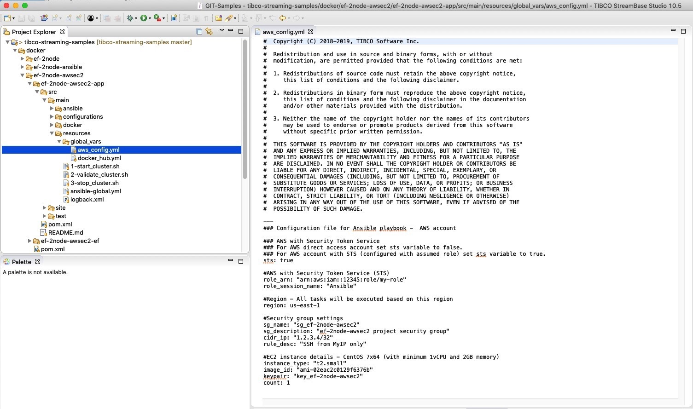
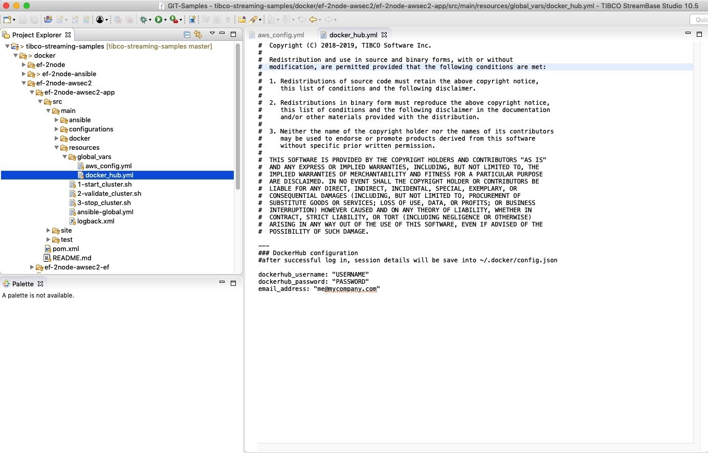
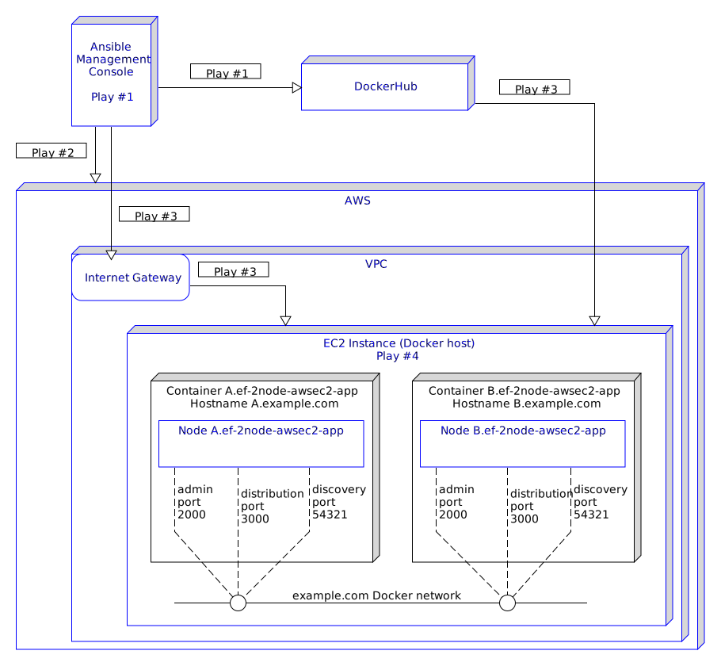
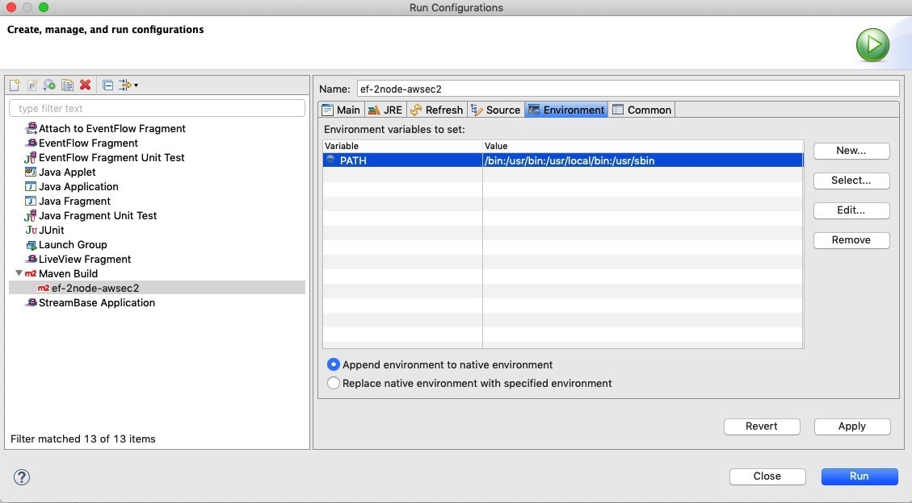

# AWS EC2: 2-node EventFlow

This sample describes how to deploy an application archive containing an EventFlow fragment based on Docker to AWS EC2 instance(s) managed by Ansible.

* [Prerequisites - Part #1](#prerequisites-part-#1)
* [Loading this sample in TIBCO StreamBase Studio&trade;](#loading-this-sample-in-tibco-streambase-studio-trade)
* [Prerequisites - Part #2](#prerequisites-part-#2)
* [Ansible playbook, plays and tasks](#ansible-playbook-plays-and-tasks)
* [Containers and nodes](#containers-and-nodes)
* [Building and running from TIBCO StreamBase Studio&trade;](#building-and-running-from-tibco-streambase-studio-trade)
* [Building this sample from the command line and running the integration test cases](#building-this-sample-from-the-command-line-and-running-the-integration-test-cases)
* [Ansible - Additional playbooks](#ansible-additional-playbooks)
* [EC2 instance - Additional scripts](#EC2-instance-additional-scripts)

See also [Docker section in TIBCO&reg; Streaming documentation](https://docs.tibco.com/pub/str/latest/doc/html/admin/part-docker.html).

<a name="prerequisites-part-#1"></a>

## Prerequisites - Part #1

This project is based on [Ansible-Docker: 2-node EventFlow](https://github.com/TIBCOSoftware/tibco-streaming-samples/blob/master/docker/ef-2node-ansible/ef-2node-ansible-app/src/site/markdown/index.md). Please follow the prerequisites listed there to make sure Docker and Ansible management server are working properly.
Ansible playbook contains several plays and tasks, executed in a sequence and dependent on each other, so it is important to complete all steps listed below.

### 1. At this point it is assumed Ansible management server is up and working properly with Docker. 
A simple playbook located under _../src/main/ansible/additional-playbooks/_ folder can be run as a test.
```shell
$ ansible-playbook ansible-docker-test-playbook.yml
```

### 2. An AWS account is required with [AWS CLI](https://docs.aws.amazon.com/cli/latest/userguide/cli-chap-install.html) tools installed and configured.
Key pair is required for ssh access to the newly launched instance.

In this project, it is assumed that either personal or federated AWS account is configured and available to use.
Please see examples below and update files as needed.

#### Personal/Individual account - user with direct access

- Both keys need to be added to this file: _~/.aws/credentials_.
```shell
[default]
aws_access_key_id = ABCDEFGH12345
aws_secret_access_key = abcdefgh1234567890
```
Access to AWS account can be tested by executing following command.
```shell
$ aws ec2 describe-instances
```

#### "Federated" AWS account with Assumed Role configured (with STS - Security Token Service)
Assumed role and access keys need to be created for Ansible module to connect with AWS account. More information in this [tutorial](https://docs.aws.amazon.com/IAM/latest/UserGuide/tutorial_cross-account-with-roles.html). 

- Both keys need to be added to this file: _~/.aws/credentials_.
```shell
[default]
aws_access_key_id = ABCDEFGH12345
aws_secret_access_key = abcdefgh1234567890
```
- Two profiles containing proper information need to be added to this file, _~/.aws/config_.
```shell
[default]
region = us-east-1
output = json

[profile my-role]
role_arn = arn:aws:iam::12345:role/my-role
region = us-east-1
source_profile = default
```
Access to AWS account can be tested by executing following commands.
```shell
$ aws ec2 describe-instances --profile my-role
```
or
```shell
$ aws sts assume-role --role-arn arn:aws:iam::12345:role/my-role --role-session-name "Ansible" --profile default
```

#### Ansible configuration files.
Both files are located in _../src/main/ansible_ folder and need to be copied to */etc/ansible/*.

- Path to the key pair is needed in this file, _../src/main/ansible/ansible.cfg_. 
File with the key should be protected from accessing it by other users. Good practice is to set read only access for owner via _chmod_ command, ex: _chmod 0400 key.pem_ ( - r-- --- --- 1 user group key.pem ).
```shell
[defaults]
inventory=inventory

host_key_checking = False
private_key_file = /home/my-user/AWS-key/key.pem    ### add path to your Key Pair

deprecation_warnings=False

# Use the YAML callback plugin.
stdout_callback = yaml
# Use the stdout_callback when running ad-hoc commands.
bin_ansible_callbacks = True
```
- _../src/main/ansible/inventory_ file can be copied and saved as is.
```shell
[localhost]
127.0.0.1 ansible_connection=local
```

### 3. A [DockerHub](https://hub.docker.com/) is required.

### 4. Installation of boto and boto3 python libraries is needed for Ansible EC2 modules to work correctly.

This installation can be completed via [Python PIP](https://pip.pypa.io/en/stable/installing/)

```shell
$ pip install boto boto3
```

<a name="loading-this-sample-in-tibco-streambase-studio-trade"></a>

## Loading this sample in TIBCO StreamBase Studio&trade;

To be able to run this sample in TIBCO StreamBase Studio™ please refer to [Using Tibco Streambase Studio GitHub page](https://github.com/TIBCOSoftware/tibco-streaming-samples/blob/master/docs/studio.md).

List of files this project is based on can be found below:

* An Ansible [playbook file](../../main/ansible/project-playbook.yml) with set of plays and tasks.
* A [base Dockerfile](../../main/docker/base/Dockerfile) to build a base image containing Linux, utilities and the TIBCO StreamBase runtime
* A [start-node](../../main/docker/base/start-node) script to start a node
* An [application Dockerfile](../../main/docker/application/Dockerfile) to build an application image containing the application archive - this is based on the base image
* [Trusted hosts HOCON configuration](../../main/configurations/security.conf) so that each container can run epadmin commands on the cluster
* [Application definition configuration](../../main/configurations/app.conf) that defines nodeType docker to use System V shared memory
* [Node deployment configuration](../../main/configurations/defaultnode.conf) that uses the above nodeType
* [AWS configuration file](../../main/resources/global_vars/aws_config.yml) with information required to access AWS account via assumed role and EC2 instance details
* [DockerHub config file](../../main/resources/global_vars/docker_hub.yml) with DockerHub credentials
* AWS files: _credentials_ and _config_, located in ~/.aws folder are needed for AWS account access (access keys and profile details) 

Note that whilst this project will create a simple Docker image and launch EC2 instance, changes to the project may be required for additional behaviors. 

<a name="prerequisites-part-#2"></a>

## Prerequisites - Part #2

To complete prerequisites process, project additional configuration files need to be updated. 
The most convenient way to do so is to edit and save the files in StreamBase Studio.
Please see examples below. 


#### Ansible-AWS config file for this project - file located in ../src/main/resources/global_vars folder



Based on the account type (Personal or Federated) _sts_ variable needs to be set properly.

For personal account, set _sts_ variable to false and skip updating #AWS with Security Token Service section. 
Continue to update #Region, #Security group settings and #EC2 instance details sections below.
For federated account, set _sts_ variable to true and continue to update all sections in this file.
```shell
---
### Configuration file for Ansible playbook -  AWS account 

### AWS with Security Token Service
### For AWS direct access account set sts variable to false.
### For AWS account with STS (configured with assumed role) set sts variable to true.
sts: true

#AWS with Security Token Service (STS)			
role_arn: "arn:aws:iam::12345:role/my-role"	 	### Role ARN
role_session_name: "Ansible"                       	### Name for the session

#Region - All tasks will be executed based on this region
region: us-east-1

#Security group settings
sg_name: "sg_ef-2node-awsec2"
sg_description: "ef-2node-awsec2 project security group"
cidr_ip: "1.2.3.4/32"
rule_desc: "SSH from MyIP only"

#EC2 instance details - CentOS 7x64 (with minimum 1vCPU and 2GB memory)
instance_type: "t2.small"
image_id: "ami-02eac2c0129f6376b"
keypair: "key_ef-2node-awsec2"				### ### Key Pair file name
count: 1						### Number of instances to launch
```
#### DockerHub - file located in ../src/main/resources/global_vars folder



- Add DockerHub credentials to this file: _docker_hub.yml_
```shell
---
### DockerHub configuration
#after successful log in, session details will be saved into ~/.docker/config.json

dockerhub_username: "USERNAME"
dockerhub_password: "PASSWORD"
email_address: "me@mycompany.com"
```

<a name="ansible-playbook-plays-and-tasks"></a>

## Ansible playbook, plays and tasks

In this sample the [playbook](https://github.com/TIBCOSoftware/tibco-streaming-samples/blob/master/docker/ef-2node-awsec2/ef-2node-awsec2-app/src/main/ansible/project-playbook.yml) is divided into several plays with tasks. Please see description below.

* Play #1: (see [selected tasks](play-1-tasks.md) with description)
  - Create StreamBase base and application docker image based on CentOs7
  - Start, validate and stop nodes (unless executed via _mvn -DskipTests=true_ command or SkipTest checkbox in StreamBase Studio is selected)
  - Based on user information in ../src/main/resources/global_vars/docker_hub.yml file: 
    - tag application docker image
    - login to dockerhub, push image, logout from dockerhub
    - untag docker image when successfully pushed to dockerhub
  - Remove both docker images (unless executed via _mvn -DskipTests=true_ command or SkipTest checkbox in StreamBase Studio is selected)
  
* Play #2: (see [selected tasks](play-2-tasks.md) with description)
  - Create a security group and ec2 instance(s) based on information in ../src/main/resources/global_vars/aws_config.yml file
  - Update inventory list - newly created ec2 instance(s) IP address will be placed into inventory list/group stored in memory
  - Wait for instance(s) to power on and ssh will be available for connection

* Play #3: (see [selected tasks](play-3-tasks.md) with description)
  - Install Docker on ec2 instance(s)
  - Pull application docker image from DockerHub
  - Copy additional-scripts to /home/centos/additional-scripts folder located on new instance(s)

* Play #4:
  - Start, validate and stop Nodes

Please note: EC2 instance(s) is powered on at this time, contains StreamBase application docker image and additional scripts. Those bash scripts can be used to run more tests via cli over the ssh connection - more information below, under EC2 instance - Additional scripts section. 

<a name="containers-and-nodes"></a>

## Containers and nodes

In this sample we name the docker container as **A.ef-2node-awsec2-app**, which hosts the StreamBase node **A.ef-2node-awsec2-app**, and **B.ef-2node-awsec2-app**, which hosts the StreamBase node **B.ef-2node-awsec2-app**.  A Docker network **example.com** connects the nodes together :



The two containers have network access to each other, but not to the docker host. 
_epadmin_ command is executed from Docker host terminal (EC2 instance(s)) by Ansible module via ssh connection.
Based on the security group created in Play #2 and its rules, only Ansible management console has access to the EC2 instance(s).

<a name="building-and-running-from-tibco-streambase-studio-trade"></a>

## Building and running from TIBCO StreamBase Studio&trade;

Use the **Run As -> Maven install** menu option to build from TIBCO StreamBase Studio&trade; or Run As shortcut.  Tests can
be skipped if required by ticking the **Skip tests**. It is important to add **PATH** variable under Environment tab with value: **/bin:/usr/bin:/usr/local/bin:/usr/sbin**. 



Plays and tasks info from Ansible playbook will show up on a console tab.


<a name="building-and-running-from-tibco-streambase-studio-trade"></a>

## Building this sample from the command line and running the integration test cases

Use the [maven commands](https://maven.apache.org) to build from the command line or Continuous Integration system:

- mvn clean  - it will clean the directories and files created by previous project
- mvn install - it will run an Ansible playbook, below is the example of the console output: Plays and tasks

Screenshot below shows Play #1 and #2 executed on Ansible management host (localhost / 127.0.0.1), Play #3 and #4 executed on EC2 instance. 
( [Example of command line output can be found here](cli-output-ef-2node-awsec2.md) )


<a name="ansible-additional-playbooks"></a>

## Ansible - Additional playbooks.

When executing this project with _maven install -DskipTest=true_ option, only docker images are built (base and application). To test those images - start, validate and stop nodes - on a localhost (Ansible management host), Ansible playbooks located in additional-playbooks folder (../src/main/ansible/additional-playbooks) can be executed. 

```shell
.
├── 1-start_cluster.yml
├── 2-validate_cluster.yml
├── 3-stop_cluster.yml
├── 4-terminate_EC2_instance.yml
└── ansible-docker-test-playbook.yml
```
Playbooks #1, #2 and #3 are described in [Ansible-Docker: 2-node EventFlow](https://github.com/TIBCOSoftware/tibco-streaming-samples/blob/master/docker/ef-2node-ansible/ef-2node-ansible-app/src/site/markdown/index.md) sample. Also _ansible-docker-test-playbook.yml_ is mentioned above.

Playbook #4 will terminate EC2 instance(s) created in this project. This playbook is located under additional playbooks folder because its execution is optional. If needed, this playbook can be added at the end of main project playbook file,
as the final play to be executed.

Instance(s) can be removed manually when all tests are completed and no longer needed. 
Please check next section about additional scripts generated and copied to the instance user home folder.

* [Terminate EC2 Instance](../../main/ansible/additional-playbooks/4-terminate_EC2_instance.yml) playbook.
```shell
	$ ansible-playbook 4-terminate_EC2_instance.yml 
```
```ansible
PLAY [AWS -- Terminate EC2 instance(s)] ********************************************************

TASK [include aws config] **********************************************************************
ok: [127.0.0.1]

TASK [Assume an existing role] *****************************************************************
changed: [127.0.0.1]

TASK [Gather EC2 facts] ************************************************************************
ok: [127.0.0.1]

TASK [EC2 instances(s) to be removed] **********************************************************
ok: [127.0.0.1]  
  ec2.instances:
      - instance(s) details are listed here -

TASK [Terminate EC2 instance(s)] ***************************************************************
changed: [127.0.0.1]
      - instance(s) details are listed here -

PLAY RECAP *************************************************************************************
127.0.0.1      : ok=5   changed=2   unreachable=0   failed=0   skipped=0   rescued=0   ignored=0   
```
This playbook contains two main tasks: Gather EC2 facts and terminate the EC2 instance(s).
Gather facts task uses _ec2_instance_facts_ module to collect information based on filter - Tag/Key/Value - Tag/Name/ef-2node-awsec2-app. Results are collected under variable _ec2_ and displayed via debug module.
Next task with _ec2_ module, based on ID's in variable _ec2.instances_, will set instance(s) state to absent (terminate it).


<a name="EC2-instance-additional-scripts"></a>

## EC2 instance - Additional scripts.

One of the plays in Ansible playbook will start, validate and stop nodes automatically, displaying task results on the console. The instance(s) will not be terminated and the docker image will remain in place.
During the execution of _mvn install_ command build process, the filtering module will create custom bash scripts from predefined templates. 
See fragment from application _pom.xml_ file below.
```xml
...
        <resources>
            <resource>
                <directory>src/main/resources</directory>
                <filtering>true</filtering>
            </resource>
        </resources>
...
```

The scripts will be copied over to instance(s) and placed into the /home/centos/additional-scripts folder.
```shell
.
├── 1-start_cluster.sh
├── 2-validate_cluster.sh
└── 3-stop_cluster.sh
```
Similar to the Ansible additional playbooks (executed on management host) those scripts can start, validate and stop nodes on EC2 instance(s) over the ssh connection.

* Start cluster script.
```shell
$ ~/additional-scripts/1-start_cluster.sh
	
Create example.com network
945ce6d71266bf054b1b5d2db71d3a4a7159c1fa577fbce8e774553cd5169b9e
Start Node A
3a9e58d8c130a97028634172b2534a03fee0d12ff69ec06f83ca7565e5c61fcb
Node A started
Start Node B
a0c1def7cdc4a2cb1bceb94a0a2c5f10176a3056be9d8500ed287e00b850b690
Node B started
```
```shell
#!/bin/bash
## Execute this script to start nodes

echo "Create example.com network"
docker network create example.com

echo "Start Node A"
docker run --detach --hostname=A.example.com --network-alias=A.example.com --name=A.ef-2node-awsec2-app --network=example.com --env=NODENAME=A.ef-2node-awsec2-app docker/ef-2node-awsec2-app:1.0.0
until docker logs A.ef-2node-awsec2-app | grep -q "COMMAND FINISHED"; do sleep 1; done
echo "Node A started"

echo "Start Node B"
docker run --detach --hostname=B.example.com --network-alias=B.example.com --name=B.ef-2node-awsec2-app --network=example.com --env=NODENAME=B.ef-2node-awsec2-app docker/ef-2node-awsec2-app:1.0.0
until docker logs B.ef-2node-awsec2-app | grep -q "COMMAND FINISHED"; do sleep 1; done
echo "Node B started"

```

* Validate cluster script.
```shell
$ ~/additional-scripts/2-start_cluster.sh
	
Run epadmin on Node A
[A.ef-2node-awsec2-app] Node Name = B.ef-2node-awsec2-app
[A.ef-2node-awsec2-app] Network Address = IPv4:B.example.com:5558,IPv4:B.example.com:5557
[A.ef-2node-awsec2-app] Current State = Up
[A.ef-2node-awsec2-app] Last State Change = 2019-08-29 19:33:47
[A.ef-2node-awsec2-app] Number of Connections = 4
[A.ef-2node-awsec2-app] Number of Queued PDUs = 0
[A.ef-2node-awsec2-app] Discovered = Dynamic
[A.ef-2node-awsec2-app] Location Code = 6931605986115105920
[B.ef-2node-awsec2-app] Node Name = A.ef-2node-awsec2-app
[B.ef-2node-awsec2-app] Network Address = IPv4:A.example.com:5558,IPv4:A.example.com:5557
[B.ef-2node-awsec2-app] Current State = Up
[B.ef-2node-awsec2-app] Last State Change = 2019-08-29 19:33:47
[B.ef-2node-awsec2-app] Number of Connections = 3
[B.ef-2node-awsec2-app] Number of Queued PDUs = 0
[B.ef-2node-awsec2-app] Discovered = Dynamic
[B.ef-2node-awsec2-app] Location Code = 4265556644685878787
Run epadmin on Node B
[B.ef-2node-awsec2-app] Node Name = A.ef-2node-awsec2-app
[B.ef-2node-awsec2-app] Network Address = IPv4:A.example.com:5558,IPv4:A.example.com:5557
[B.ef-2node-awsec2-app] Current State = Up
[B.ef-2node-awsec2-app] Last State Change = 2019-08-29 19:33:47
[B.ef-2node-awsec2-app] Number of Connections = 3
[B.ef-2node-awsec2-app] Number of Queued PDUs = 0
[B.ef-2node-awsec2-app] Discovered = Dynamic
[B.ef-2node-awsec2-app] Location Code = 4265556644685878787
[A.ef-2node-awsec2-app] Node Name = B.ef-2node-awsec2-app
[A.ef-2node-awsec2-app] Network Address = IPv4:B.example.com:5558,IPv4:B.example.com:5557
[A.ef-2node-awsec2-app] Current State = Up
[A.ef-2node-awsec2-app] Last State Change = 2019-08-29 19:33:47
[A.ef-2node-awsec2-app] Number of Connections = 4
[A.ef-2node-awsec2-app] Number of Queued PDUs = 0
[A.ef-2node-awsec2-app] Discovered = Dynamic
[A.ef-2node-awsec2-app] Location Code = 6931605986115105920
```
```shell
#!/bin/bash
## Execute this script to validate cluster

echo "Run epadmin on Node A"
docker exec A.ef-2node-awsec2-app epadmin --servicename=ef-2node-awsec2-app display cluster

echo "Run epadmin on Node B"
docker exec B.ef-2node-awsec2-app epadmin --servicename=ef-2node-awsec2-app display cluster
```

* Stop cluster script.
```shell
$ ~/additional-scripts/3-start_cluster.sh
	
Stop and remove Node A
A.ef-2node-awsec2-app
Node A stopped
A.ef-2node-awsec2-app
Node A removed
Stop and remove Node B
B.ef-2node-awsec2-app
Node B stopped
B.ef-2node-awsec2-app
Node B removed
Remove example.com network
example.com
```
```shell
#!/bin/bash
## Execute this script to stop and remove cluster

echo "Stop and remove Node A"
docker stop A.ef-2node-awsec2-app
echo "Node A stopped"
docker rm A.ef-2node-awsec2-app
echo "Node A removed"

echo "Stop and remove Node B"
docker stop B.ef-2node-awsec2-app
echo "Node B stopped"
docker rm B.ef-2node-awsec2-app
echo "Node B removed"

echo "Remove example.com network"
docker network remove example.com
```
---
Copyright (c) 2018-2019, TIBCO Software Inc.

Redistribution and use in source and binary forms, with or without
modification, are permitted provided that the following conditions are met:

* Redistributions of source code must retain the above copyright notice, this
  list of conditions and the following disclaimer.

* Redistributions in binary form must reproduce the above copyright notice,
  this list of conditions and the following disclaimer in the documentation
  and/or other materials provided with the distribution.

* Neither the name of the copyright holder nor the names of its
  contributors may be used to endorse or promote products derived from
  this software without specific prior written permission.

THIS SOFTWARE IS PROVIDED BY THE COPYRIGHT HOLDERS AND CONTRIBUTORS "AS IS"
AND ANY EXPRESS OR IMPLIED WARRANTIES, INCLUDING, BUT NOT LIMITED TO, THE
IMPLIED WARRANTIES OF MERCHANTABILITY AND FITNESS FOR A PARTICULAR PURPOSE ARE
DISCLAIMED. IN NO EVENT SHALL THE COPYRIGHT HOLDER OR CONTRIBUTORS BE LIABLE
FOR ANY DIRECT, INDIRECT, INCIDENTAL, SPECIAL, EXEMPLARY, OR CONSEQUENTIAL
DAMAGES (INCLUDING, BUT NOT LIMITED TO, PROCUREMENT OF SUBSTITUTE GOODS OR
SERVICES; LOSS OF USE, DATA, OR PROFITS; OR BUSINESS INTERRUPTION) HOWEVER
CAUSED AND ON ANY THEORY OF LIABILITY, WHETHER IN CONTRACT, STRICT LIABILITY,
OR TORT (INCLUDING NEGLIGENCE OR OTHERWISE) ARISING IN ANY WAY OUT OF THE USE
OF THIS SOFTWARE, EVEN IF ADVISED OF THE POSSIBILITY OF SUCH DAMAGE.
