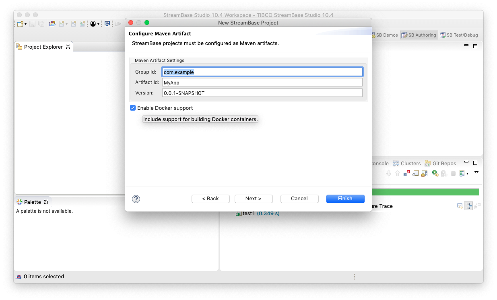
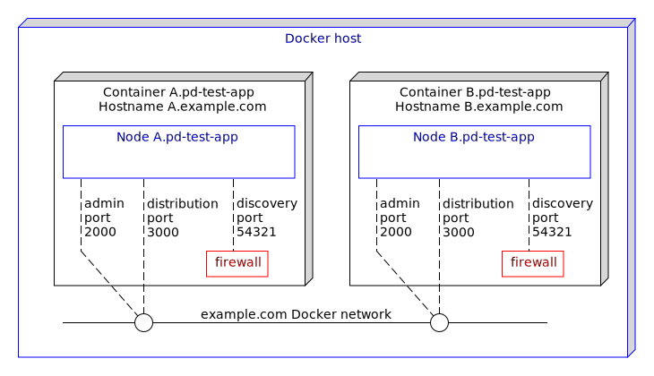

# Docker : 2-node active active with proxy discovery

Testing proxy discovery configurations can be difficult since often in test hardware, networks
do not block the discovery messages.  This sample describes how to use docker to test proxy discovery.

* [Creating an application archive project for Docker from TIBCO StreamBase Studio&trade;](#creating-an-application-archive-project-for-docker-from-tibco-streambase-studio-trade)
* [Machines and nodes](#machines-and-nodes)
* [Changes to the default configurations](#changes-to-the-default-configurations)
* [Building this sample from the command line and running the integration test cases](#building-this-sample-from-the-command-line-and-running-the-integration-test-cases)

See also [Docker section in TIBCO&reg; Streaming documentation](https://docs.tibco.com/pub/str/10.4.0/doc/html/admin/part-docker.html).

## Creating an application archive project for Docker from TIBCO StreamBase Studio&trade;

TIBCO StreamBase Studio&trade; can generate a project containing the necessary files to build and 
test a Docker image by selecting **Enable Docker support** when creating an application archive project :



Such a project includes :

* A [base Dockerfile](../../main/docker/base/Dockerfile) to build a base image containing Linux, utilities and the TIBCO StreamBase runtime
* A [start-node](../../main/docker/base/start-node) script to start a node
* An [application Dockerfile](../../main/docker/application/Dockerfile) to build an application image containing the application archive - this is based on the base image
* Steps in [pom.xml](../../../pom.xml) that uses [fabric8io/docker-maven-plugin](http://dmp.fabric8.io/) to build the Docker image and start Docker containers for basic testing
* [Trusted hosts HOCON configuration](../../main/configurations/security.conf) so that each container can run epadmin commands on the cluster
* [Application definition configuration](../../main/configurations/app.conf) that defines nodeType docker to use System V shared memory
* [Node deployment configuration](../../main/configurations/defaultnode.conf) that uses the above nodeType

## Machines and nodes

In this sample we name the docker machines as **A.example.com**,  which hosts the StreamBase node **A.pd-test-app**, and **B.example.com**, which hosts the StreamBase node **B.pd-test-app**.



A firewall is configured to block the discovery network packets to test proxy discovery.

## Changes to the default configurations

The [Node deployment configuration](../../main/configurations/defaultnode.conf) is updated to include the 
prodxy discovery configuration :

```
        nodes = {
            "A.pd-test-app" = { 
                nodeType = docker
                engines = {
                    pd-test-ef = {
                        fragmentIdentifier = "com.tibco.ep.samples.docker.pd-test-ef"
                    }
                }
                communication = {
                    administration = {
                        address = ${A_HOSTNAME:-A.example.com}
                        transportPort = ${A_ADMINPORT:-2000}
                    }
                    distributionListenerInterfaces = [ {
                        address = ${A_HOSTNAME:-A.example.com}
                        dataTransportPort = ${A_DATATRANSPORTPORT:-3000}
                    } ]
                    proxyDiscovery = {
                        remoteNodes = [ ".*" ]
                    }
                }
            }
```

The base image [Dockerfile](../../main/docker/base/Dockerfile) is updated to include the sudo tool and its configuration :

```dockerfile
RUN yum --assumeyes install \
    sysstat \
    gdb \
    java-1.8.0-openjdk \
    zip \
    unzip \
    perl \
    net-tools \
    iptables \
    tc \
    sudo \
    && yum clean all
...
RUN echo "${USER_NAME} ALL=(ALL) NOPASSWD: ALL" >> /etc/sudoers
```

The [start-node](../../main/docker/base/start-node) script is updated to set firewall rules to drop in-bound discovery :

```shell
sudo iptables -I INPUT ! -s ${HOSTNAME} -p udp --dport 54321 -j DROP
```

The maven [pom.xml](../../../pom.xml) file is updated to detect if docker is installed :

```xml
    <properties>
        <dockerDomain>example.com</dockerDomain>
        <skipApplicationDocker>true</skipApplicationDocker>
        <skipStreamBaseDockerBase>true</skipStreamBaseDockerBase>
        <skipDockerTests>true</skipDockerTests>
    </properties>
    ...
    <!-- if docker is available, build docker projects -->
    <profile>
        <id>Docker in local</id>
        <activation>
            <file>
                <exists>/usr/local/bin/docker</exists>
            </file>
        </activation>
        <properties>
            <skipApplicationDocker>false</skipApplicationDocker>
            <skipStreamBaseDockerBase>false</skipStreamBaseDockerBase>
            <skipDockerTests>${skipTests}</skipDockerTests>
        </properties>
    </profile>
    <profile>
        <id>Docker in bin</id>
        <activation>
            <file>
                <exists>/usr/bin/docker</exists>
            </file>
        </activation>
        <properties>
            <skipApplicationDocker>false</skipApplicationDocker>
            <skipStreamBaseDockerBase>false</skipStreamBaseDockerBase>
            <skipDockerTests>${skipTests}</skipDockerTests>
        </properties>
    </profile>
    <profile>
        <id>Docker in C:</id>
        <activation>
            <file>
                <exists>C:\Program Files\Docker\Docker\resources\bin\docker.exe</exists>
            </file>
        </activation>
        <properties>
            <skipApplicationDocker>false</skipApplicationDocker>
            <skipStreamBaseDockerBase>false</skipStreamBaseDockerBase>
            <skipDockerTests>${skipTests}</skipDockerTests>
        </properties>
    </profile>
``` 

and include running **epadmin display cluster** when the nodes are started - this shows if the nodes are connected to each other via the proxy discovery configuration :

```xml
    <exec>
        <postStart>epadmin servicename=B.${project.artifactId} display cluster</postStart>
    </exec>
```

## Building this sample from the command line and running the integration test cases

Use the [maven](https://maven.apache.org) as **mvn install** to build from the command line or Continuous Integration system :


