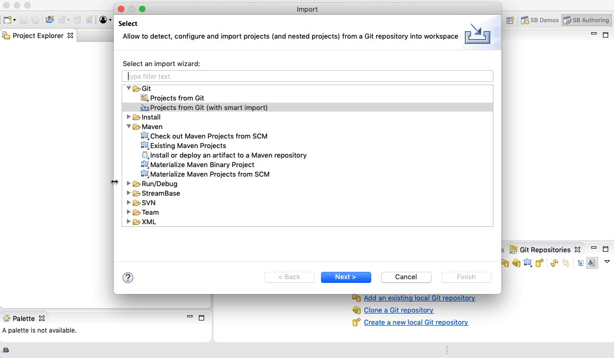
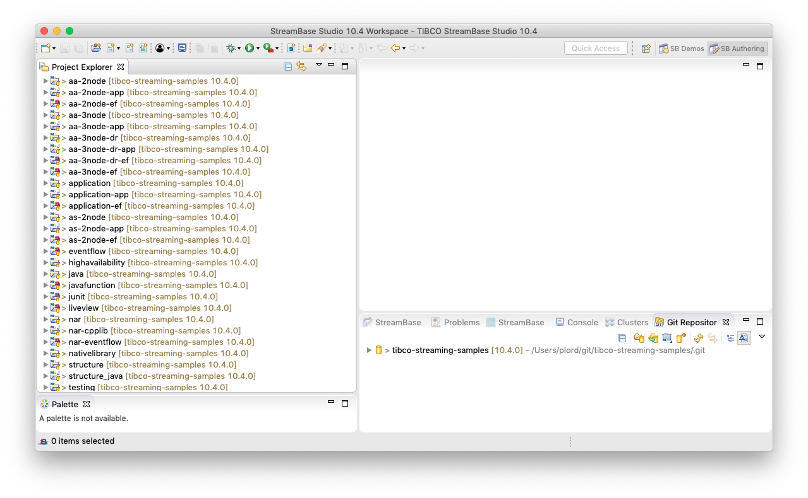

# Using in TIBCO StreamBase Studio&trade;

These samples are kept on-line in github - this allows browsing of the samples on-line,
support of contributions outside of TIBCO engineering and updates outside of the main
product release lifecycle.

The samples can also be imported into TIBCO StreamBase Studio&trade; :

## Using TIBCO menu

* Use **File -> Load StreamBase Sample**
* Choose github sample
* Select **Import Now**

The local github clone can be updated with **Pull from remote repositories now**.

## Using smart import

* Use **Import -> Git -> Projects from Git ( with smart import )** menu option.  
* Select **Clone URI -> Next**
* Specify the github URL ( https://github.com/TIBCOSoftware/tibco-streaming-samples.git )
* Select the branch that corresponds to the product version you are using
* Choose what sample(s) to import :

## Working with multiple projects

By default, projects are organized in TIBCO StreamBase Studio&trade; in a flat structure :

With multiple projects ( such as importing all the samples ) this can become confusing.  Use
**Projects Presentation -> Hierarchical** for a more structured organization :

## Other useful eclipse plugins

* [Markdown Text Editor](https://marketplace.eclipse.org/content/markdown-text-editor)
* [GitHub Flavored Markdown viewer plugin](https://marketplace.eclipse.org/content/github-flavored-markdown-viewer-plugin)
* [Mylyn WikiText](https://marketplace.eclipse.org/content/mylyn-wikitext)
* [Docker tooling](https://marketplace.eclipse.org/content/eclipse-docker-tooling) ( requires [TM Terminal](https://marketplace.eclipse.org/content/tm-terminal) )
* [Eclipse Copyright Generator](https://jmini.github.io/Eclipse-Copyright-Generator/)
