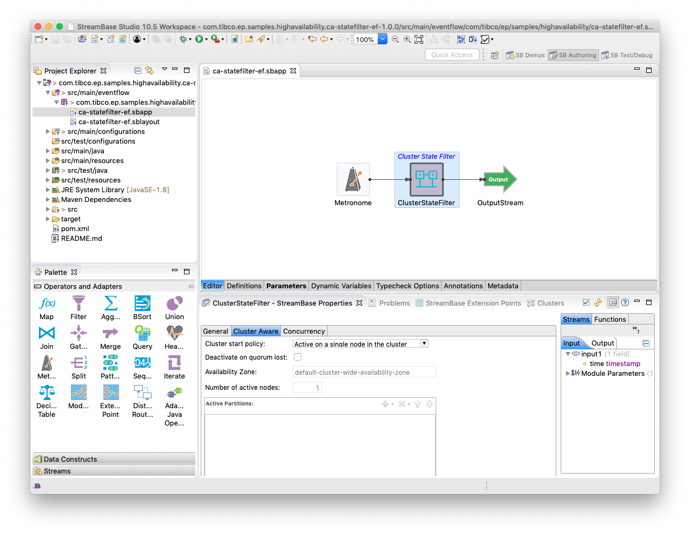
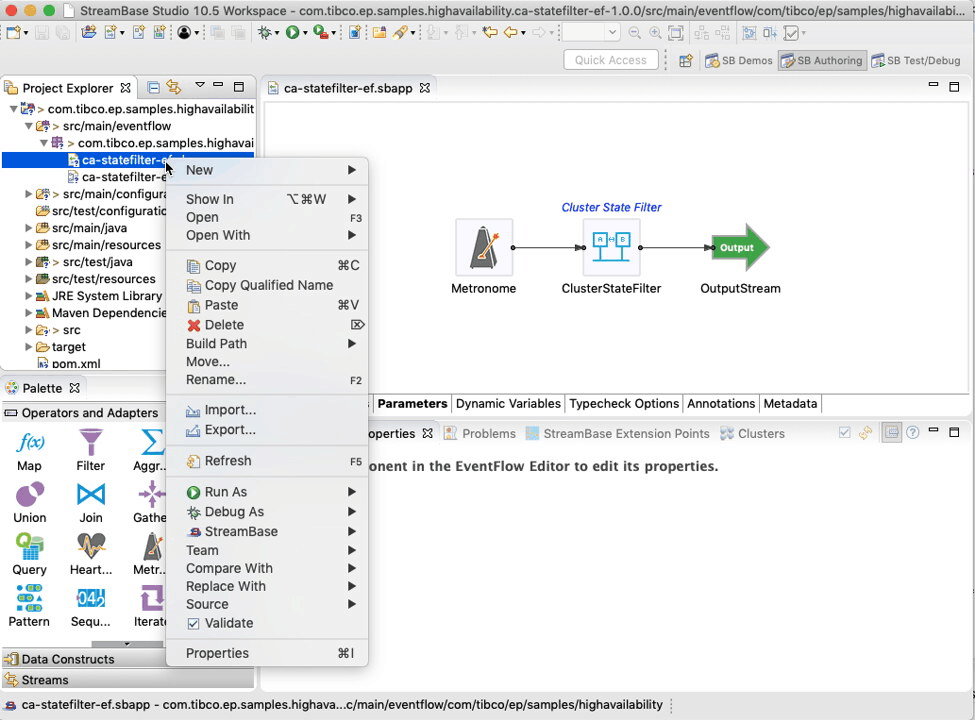
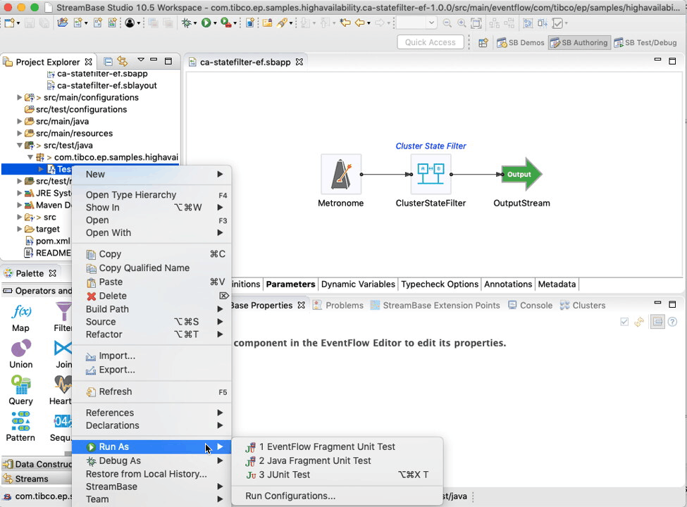
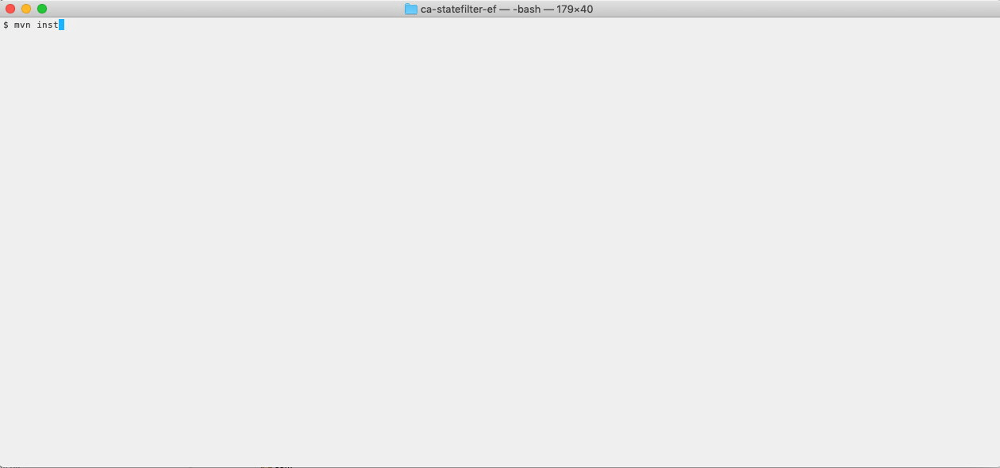

# HA : Cluster aware state filter

This sample describes how to build an EventFlow fragment with a cluster-aware state filter.

* [Enable cluster aware settings in operator](#enable-cluster-aware-settings-in-operator)
* [Design notes](#design-notes)
* [Running this sample from TIBCO StreamBase Studio&trade;](#running-this-sample-from-tibco-streambase-studio-trade)
* [Building this sample from TIBCO StreamBase Studio&trade; and running the unit test cases](#building-this-sample-from-tibco-streambase-studio-trade-and-running-the-unit-test-cases)
* [Building this sample from the command line and running the unit test cases](#building-this-sample-from-the-command-line-and-running-the-unit-test-cases)

## Enable cluster aware settings in operator

A metronome adapter is used regularly emit tuples with a state filter.  The state filter is configured
to be **cluster aware** - that is, the operator is started and stopped depending on the state of the cluster.

## Design notes

The cluster aware option **Active on a single node in the cluster** was selected, hence :

* Only one node in the cluster will process the metronome tuples regardless of the number of nodes
* Should the node processing the metronome tuples fail, another node in the cluster will start processing the tuples

## Running this sample from TIBCO StreamBase Studio&trade;

Use the **Run As -> EventFlow Fragment** menu option to run in TIBCO StreamBase Studio&trade;.

Note that here we are unit testing the business logic rather than cluster aware - in this sample we test cluster aware in
the application archive integration test cases.

## Building this sample from TIBCO StreamBase Studio&trade; and running the unit test cases

Use the **Run As -> EventFlow Fragment Unit Test** menu option to build from TIBCO StreamBase Studio&trade; :

## Building this sample from the command line and running the unit test cases

Use the [maven](https://maven.apache.org) as **mvn install** to build from the command line or Continuous Integration system :

