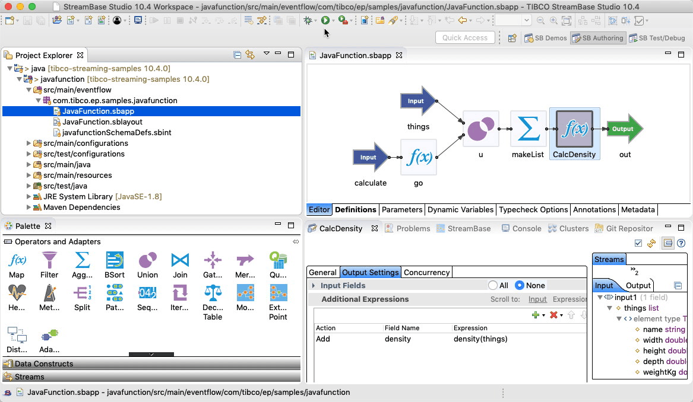

[comment]: # (  Copyright \(C\) 2018-2019, TIBCO Software Inc.                               )

[comment]: # (                                                                               )

[comment]: # (  Redistribution and use in source and binary forms, with or without           )

[comment]: # (  modification, are permitted provided that the following conditions are met:  )

[comment]: # (                                                                               )

[comment]: # (  1. Redistributions of source code must retain the above copyright notice,    )

[comment]: # (     this list of conditions and the following disclaimer.                     )

[comment]: # (                                                                               )

[comment]: # (  2. Redistributions in binary form must reproduce the above copyright notice, )

[comment]: # (     this list of conditions and the following disclaimer in the documentation )

[comment]: # (     and/or other materials provided with the distribution.                    )

[comment]: # (                                                                               )

[comment]: # (  3. Neither the name of the copyright holder nor the names of its contributors)

[comment]: # (     may be used to endorse or promote products derived from this software     )

[comment]: # (     without specific prior written permission.                                )

[comment]: # (                                                                               )

[comment]: # (  THIS SOFTWARE IS PROVIDED BY THE COPYRIGHT HOLDERS AND CONTRIBUTORS "AS IS"  )

[comment]: # (  AND ANY EXPRESS OR IMPLIED WARRANTIES, INCLUDING, BUT NOT LIMITED TO, THE    )

[comment]: # (  IMPLIED WARRANTIES OF MERCHANTABILITY AND FITNESS FOR A PARTICULAR PURPOSE   )

[comment]: # (  ARE DISCLAIMED. IN NO EVENT SHALL THE COPYRIGHT HOLDER OR CONTRIBUTORS BE    )

[comment]: # (  LIABLE FOR ANY DIRECT, INDIRECT, INCIDENTAL, SPECIAL, EXEMPLARY, OR          )

[comment]: # (  CONSEQUENTIAL DAMAGES \(INCLUDING, BUT NOT LIMITED TO, PROCUREMENT OF        )

[comment]: # (  SUBSTITUTE GOODS OR SERVICES; LOSS OF USE, DATA, OR PROFITS; OR BUSINESS     )

[comment]: # (  INTERRUPTION\) HOWEVER CAUSED AND ON ANY THEORY OF LIABILITY, WHETHER IN     )

[comment]: # (  CONTRACT, STRICT LIABILITY, OR TORT \(INCLUDING NEGLIGENCE OR OTHERWISE\)    )

[comment]: # (  ARISING IN ANY WAY OUT OF THE USE OF THIS SOFTWARE, EVEN IF ADVISED OF THE   )

[comment]: # (  POSSIBILITY OF SUCH DAMAGE.                                                  )

# Java : Java Function

This sample describes how to use java functions in EventFlow.

## EventFlow under test

In this sample the following simple EventFlow fragment is used :


## Declare the java function

See [UtilFunctions.java](../../src/main/java/com/tibco/ep/samples/javafunction/UtilFunctions.java).


## Provide a engine configuration for EventFlow use

A engine configuration is required to declare the functions available :

```scala
name = "javafunction-engine"
version = "1.0.0"
type = "com.tibco.ep.streambase.configuration.sbengine"

configuration = {
    StreamBaseEngine = {
        streamBase = {
            pluginFunctions = {
                java = {
                    Density = {
                        type = "simple"
                        alias = "density"
                        className = "com.tibco.ep.samples.javafunction.UtilFunctions"
                        autoArguments = true
                    }
                }
            }
        }
    }
}

```

## Running this sample from TIBCO StreamBase Studio&trade;

Use the **Run As -> EventFlow Fragment** menu option to run in TIBCO StreamBase Studio&trade;, and then enqueue tuples :



## Building this sample from TIBCO StreamBase Studio&trade; and running the unit test cases

Use the **Run As -> EventFlow Fragment Unit Test** menu option to build from TIBCO StreamBase Studio&trade; :


## Building this sample from the command line and running the unit test cases

Use the [maven](https://maven.apache.org) as **mvn install** to build from the command line or Continuous Integration system :


