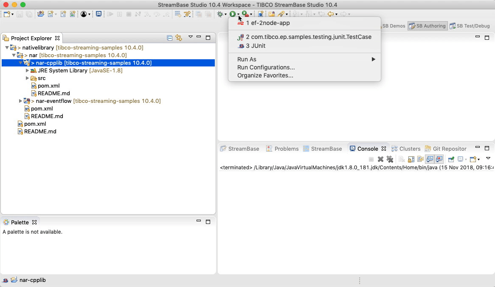
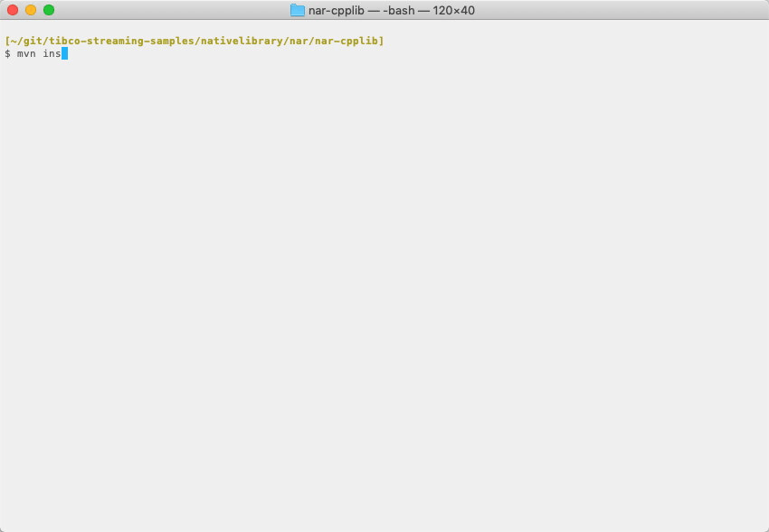

# Native : NAR

This sample describes how to build a maven Native ARchive files (.nar) from C++ source.  The
resulting archive can then be used in a downstream EventFlow fragment.

* [C++ Source](#c-source)
* [Compilation to native library and generate NAR archive](#compilation-to-native-library-and-generate-nar-archive)
* [Environmental requirements](#environmental-requirements)
* [Building this sample from TIBCO StreamBase Studio&trade; and running the unit test cases](#building-this-sample-from-tibco-streambase-studio-trade-and-running-the-unit-test-cases)
* [Building this sample from the command line and running the unit test cases](#building-this-sample-from-the-command-line-and-running-the-unit-test-cases)

<a name="c-source"></a>

## C++ Source

The sample C++ source code provides functions to manipulate a static int :


```C++
#include "jni.h"
#include "com_tibco_ep_samples_nativelibrary_narcpplib_NarSystem.h"

extern "C" {

static int ivalue = 0;

JNIEXPORT jint JNICALL Java_com_tibco_ep_samples_nativelibrary_narcpplib_CallCpp_setCppInt(JNIEnv *env, jclass clazz, jint i)
{
  int oldval = ivalue;
  
  ivalue = i;
  
  return oldval;
}

JNIEXPORT jint JNICALL Java_com_tibco_ep_samples_nativelibrary_narcpplib_CallCpp_incrementCppInt(JNIEnv *env, jclass clazz, jint i)
{
  ivalue += i;
  return ivalue;
}


}
```

<a name="compilation-to-native-library-and-generate-nar-archive"></a>

## Compilation to native library and generate NAR archive

The [maven nar plugin](http://maven-nar.github.io/) is used to invoke the native complier and build the Native ARchive file (.nar).  
The following maven build rule is used :

```xml
            <plugin>
                <groupId>com.github.maven-nar</groupId>
                <artifactId>nar-maven-plugin</artifactId>
                <extensions>true</extensions>
                <configuration>
                    <libraries>
                        <library>
                            <type>jni</type>
                            <narSystemPackage>com.tibco.ep.samples.nativelibrary.narcpplib</narSystemPackage>
                        </library>
                    </libraries>
                </configuration>
            </plugin>
```

<a name="environmental-requirements"></a>

## Environmental requirements

To build a shared library from source, native compilers must be correctly installed - see [maven nar plugin](http://maven-nar.github.io/)
for full details.  However, this sample has been tested with :

* MacOS - [Xcode](https://developer.apple.com/xcode/)
* Linux - [the GNU Compiler Collection](https://www.gnu.org/software/gcc/)
* Windows - [Visual Studio](https://visualstudio.microsoft.com/)

For windows, ensure the COMNTOOLS environment variable is set, for example :

```
VS120COMNTOOLS=C:\\Program Files\ (x86)\\Microsoft\ Visual\ Studio\ 12.0\\Common7\\Tools\\
```

<a name="building-this-sample-from-tibco-streambase-studio-trade-and-running-the-unit-test-cases"></a>

## Building this sample from TIBCO StreamBase Studio&trade; and running the unit test cases

Use the **Run As -> Maven install** menu option to build from TIBCO StreamBase Studio&trade; :



<a name="building-this-sample-from-the-command-line-and-running-the-unit-test-cases"></a>

## Building this sample from the command line and running the unit test cases

Use the [maven](https://maven.apache.org) as **mvn install** to build from the command line or Continuous Integration system :


